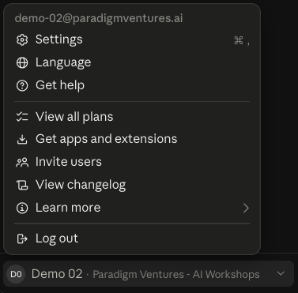
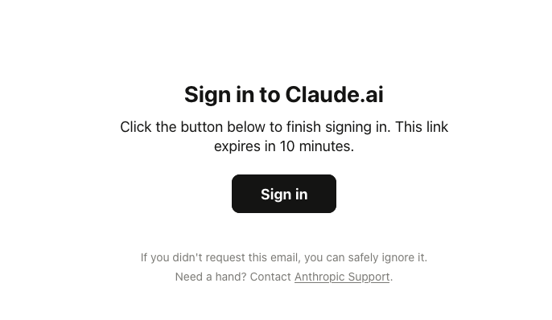
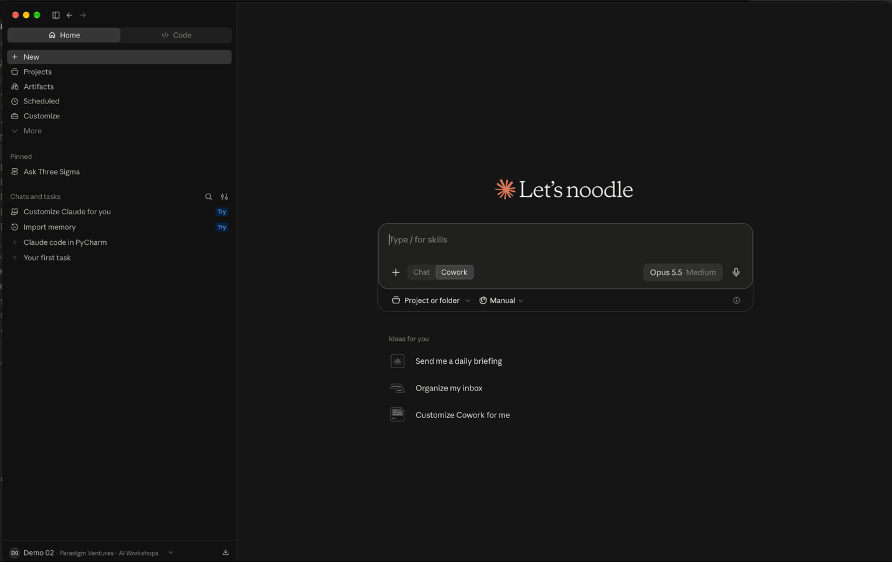
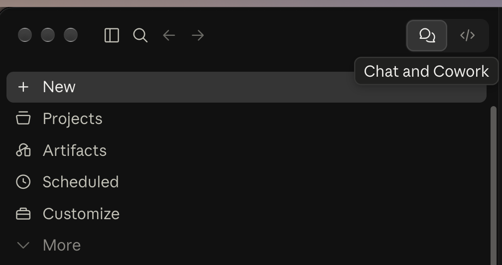
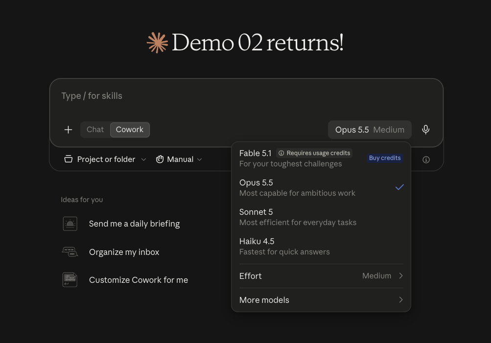
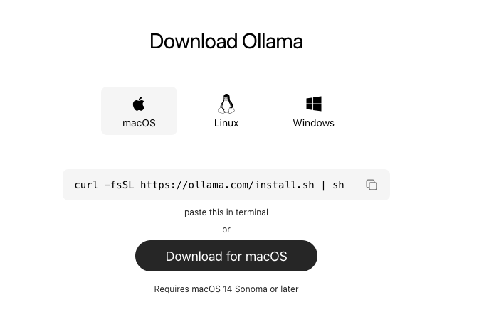
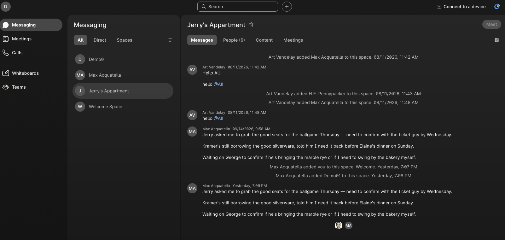

<!--
STYLE GUIDE FOR THE LAB GUIDES (this comment doesn't appear in the preview)
- Headings: one # title per document; ## for main sections; ### for sub-steps.
- Bullets: * for top-level bullets, - for sub-bullets.
- Label bullets: start with a bold label and a colon, e.g. **Ollama:** a free tool...
- Things to click or press: bold, with the exact wording on screen, e.g. click **+ New**, press **Return**.
- Commands: in a code block on their own line, never bold.
- Files, folders and email addresses: `code` style.
- Links: clickable with readable text, e.g. [ollama.com/download](https://ollama.com/download).
- Names: Webex (not WebEx), Claude desktop app, Ollama, uv, Lab 00 / Lab 01 / Lab 02 / Lab 03.
- Images: centered <p align="center"> block with a width, one <br> before and after.
- Placeholders: [PLACEHOLDER - description] on its own line, with an empty line before and after.
- Punctuation: full sentences end with a period; no double spaces; use an em dash (—), not --.
- Spacing: one <br> (with empty lines around it) before each section heading, except the first.
-->

# Lab 00 — Let's Get Started!

## Introduction

The goal of this document is to walk you through the steps of setting up the basics of what you'll need on your laptop to work on the lab.

If you have time before the workshop, you can do this setup at home. It will save you time in the lab.

* **All guides and materials:** [gcodekhanna1.github.io/2026-10-ai-skills-lab](https://gcodekhanna1.github.io/2026-10-ai-skills-lab/). Each guide is a web page, with a PDF version to print or save.

<br>

## Overview of What You Need

* **Laptop:** preferably yours, so you can easily keep all the code and files related to what you built.

* **Organization account:** note your account for the lab, `demo-xy@paradigmventures.ai`, where **xy** is the number on your desk (for example, `demo-07@paradigmventures.ai`).
    - This will be your account for accessing other services throughout this lab.

* **Claude desktop app:** our main engine for building the lab, vibe coding, and asking questions.

* **Ollama:** a free, open-source platform that lets you download and run large language models (LLMs) directly on your own computer.

* **uv:** a fast, free tool that installs Python and the add-on libraries ("packages") each app needs, keeping every project's setup separate and tidy. You don't need to install it now: the start file Claude creates in Lab 01 installs it for you.

* **Email access:** a way to access one of your email accounts (either a work-related or personal account) to receive the verification link from Claude.

* **Web browser:** to access the Webex organization you'll be a part of (used in Lab 02, and so the lab team can send you files and help during the workshop).

* **Note:** you'll install a few free tools (Ollama now, and uv in Lab 01). If your work laptop doesn't allow installs, ask us for a lab PC.

<br>

## Create a Folder for Your Lab Files

* Create a folder on your desktop:
    - Give it a unique name, such as `2026 - WebexOne - AI Skills Lab - Demo XY`, where "XY" corresponds to your organization email handle.
    - This is the folder that will contain all the files and dependencies for what you will be building in this lab.


<br>

## Claude Desktop App

### Install the Claude desktop app

* If you have not done so already, install the Claude desktop app from [claude.com/download](https://claude.com/download).
    - **Already have it?** Update it to the latest version before the lab.

* Double-click the installer file and follow the directions.

### Log into the Claude desktop app

* Note your organization account email. It should have a format such as `demo-xy@paradigmventures.ai`.

* Use that to log into Claude (see the lower left corner of the application).

<br>
<p align="center">
  
</p>
<br>

* Log into your email account and look for the verification link, which should look like the screenshot below. **Open the link on the same laptop where you're running Claude.**
    - **Note:** your work or personal email was added as a forwarding address in your Outlook account.
    - **Asked for a code?** Claude's screen may mention a code, but the email contains a sign-in **link** instead. Just click the link.

<br>
<p align="center">
  
</p>
<br>

* Here is what your screen should look like once your email has been verified:

<br>
<p align="center">
  
</p>
<br>

### Start a Cowork session

* At the top right of the sidebar, make sure **Chat and Cowork** (the speech-bubble icon) is selected.

<br>
<p align="center">
  
</p>
<br>

* In the upper left corner, click the **+ New** button.
    - **Don't see it?** The sidebar may be hidden: click the sidebar icon at the top left to show it.

<br>
<p align="center">
  
</p>
<br>

* Configure the session to be a Cowork session:
    - In the dialog box, select **Cowork** (instead of **Chat**).
    - Leave the default model as **Opus 5.5** (it is one of the latest models from Anthropic).
    - Click **Project or folder** and select the folder you created earlier (e.g., `2026 - WebexOne - AI Skills Lab - Demo XY`).
    - If Claude asks for permission to access the folder, click **Always Allow**.
    - Check that the folder is connected: its name should show in the session. If it doesn't, add it again.

* **Approval prompts:** as you work, Claude asks before some actions. Read the request, then click **Allow** (or **Allow for this task**, so it doesn't ask again for the same kind of action).

<br>

## Install Ollama

* Download and install Ollama for your operating system from [ollama.com/download](https://ollama.com/download).

<br>
<p align="center">
  
</p>
<br>

### Check that Ollama is running

* **Menu bar:** after installing, open the Ollama app. On a Mac, a small llama icon appears in the menu bar at the top right of your screen (on Windows, in the system tray near the clock). If you see it, Ollama is running.

* **Terminal:** you can also check from a terminal window, a text window where you type commands. You'll use it in every lab.
    - **Mac:** press **⌘ + Space**, type **Terminal**, and press **Return**.
    - **Windows:** click **Start**, type **PowerShell**, and press **Enter**.
    - Type the following command and press **Return** (or **Enter**):

```sh
ollama --version
```

* You should see a line like `ollama version is 0.x.x`. If you see `command not found` instead, open the Ollama app once and try again.

* Ollama starts with no AI models installed. Each lab will tell you which model to download when you need it.

<br>

## Access Webex Messaging

* **Why now:** you won't need Webex until Lab 02, but once you're signed in, the lab team can send you files and help directly in Webex if you get stuck.

* In your web browser, open a private (incognito) window and go to [web.webex.com](https://web.webex.com).

* Sign in with your organization email, `demo-xy@paradigmventures.ai`. The password is `Cisco123#`.

* You should see some Webex spaces with conversations already underway:

<br>
<p align="center">
  
</p>
<br>

<br>

## What's Next

* **Next:** you're all set up! Continue to [Lab 01 — Build Your Personal Knowledge Base](Lab_01_Guide_Knowledge_Base.html).
