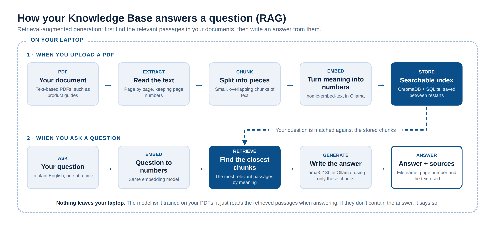
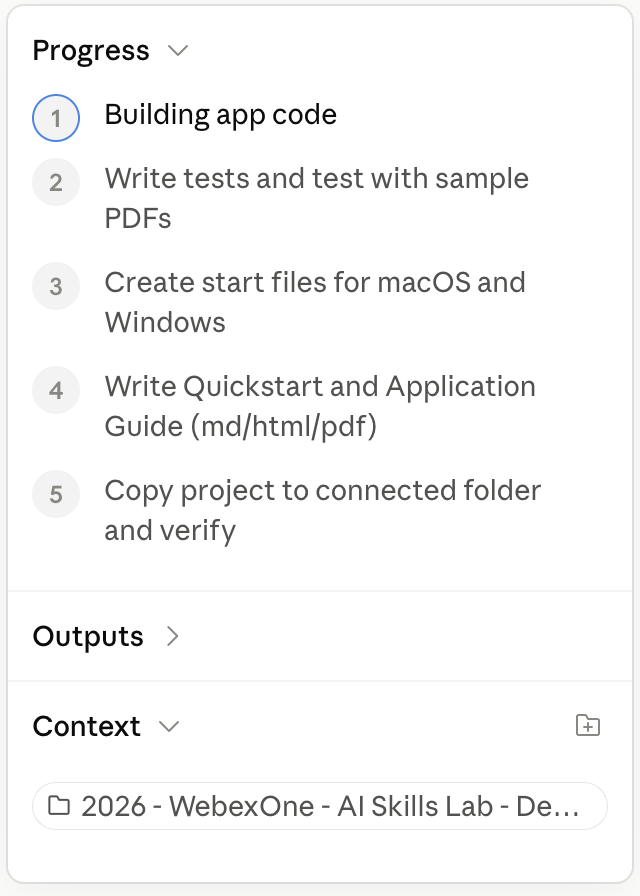
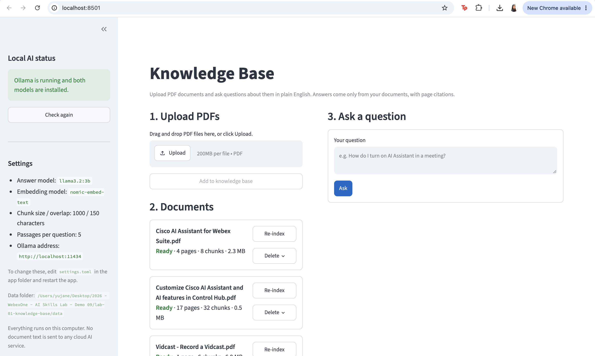

<!--
STYLE GUIDE FOR THE LAB GUIDES (this comment doesn't appear in the preview)
- Headings: one # title per document; ## for main sections; ### for sub-steps.
- Heading capitalization: Title Case, e.g. "Start a Cowork Session". Capitalize every word except short words (a, an, the, and, or, to, of, in, on, for, as, with) unless they come first.
- Bullets: * for top-level bullets, - for sub-bullets.
- Label bullets: start with a bold label and a colon, e.g. **Ollama:** a free tool...
- Things to click or press: bold, with the exact wording on screen, e.g. click **+ New**, press **Return**.
- Commands: in a code block on their own line, never bold.
- Files, folders and email addresses: `code` style.
- Links: clickable with readable text, e.g. [ollama.com/download](https://ollama.com/download).
- Names: Webex (not WebEx), Claude desktop app, Ollama, uv, Lab 00 / Lab 01 / Lab 02 / Lab 03 / Lab 04.
- Images: centered <p align="center"> block with a width, one <br> before and after.
- Placeholders: [PLACEHOLDER - description] on its own line, with an empty line before and after.
- Punctuation: full sentences end with a period; no double spaces; use an em dash (—), not --.
- Spacing: one <br> (with empty lines around it) before each section heading, except the first.
-->

# Lab 01 — Build Your Personal Knowledge Base

*Ask questions about your own documents and get answers with sources, using an AI model that runs privately on your laptop*.

## Introduction

Many of us need to find answers buried in long documents, and often those documents shouldn't leave our computer. This is usually due to privacy or security reasons.

In this lab, you'll build a private Knowledge Base that searches your own documents and answers questions about them, showing the sources it used. In addition, we will be setting up an LLM that runs on your laptop, so that none of the data from the source documents goes to a cloud model. Despite all the advances in AI models, this technique, commonly referred to as retrieval-augmented generation (RAG), remains one of the most widespread and powerful uses of generative AI.

The goal of this lab is to build a minimum viable product (MVP): a simple, working version that performs this function. Focus on trying ideas, checking that the app works, and using follow-up prompts to improve it. You don’t need a polished product by the end; this lab is about practicing how to turn an idea into something useful with AI.

<br>

## Before You Start

Your app may look and work a little differently from the examples or from the apps built by others in the lab. That’s expected! AI coding tools can suggest different approaches, and there are many ways to solve the same problem.

* **Your path today:** Labs 01 and 02 are the core of this workshop. After that, choose your own adventure: Lab 03 (a guided lab), Lab 04 (your own project), or both.

<br>

## What You’ll Build

* In this lab, you’ll use an AI coding tool (Claude Cowork) to build a simple Knowledge Base—a web page where you can upload documents (such as Webex documentation), browse them, and ask questions about them in plain language.
* You’ll guide the coding tool through prompts, or instructions describing what you want the app to do.
* Start with a basic idea, try what it builds, and use follow-up prompts to fix issues or add improvements.

<br>

## Behind the Scenes (Optional Reading)

Behind the scenes, the app uses RAG to find relevant information in your documents before generating an answer. When you upload a PDF, the app extracts its text, splits it into smaller pieces, and creates embeddings (numerical representations that help it search by meaning), rather than just matching exact words. These are stored locally so the documents are ready to search whenever you ask a question.

<br>
<p align="center">
  
</p>
<br>

The app finds the most relevant pieces and passes them, along with your question, to an AI model. Ollama runs the models on your computer, handling both embedding creation and answer generation. This doesn’t train the model on your PDFs; it gives the model relevant reference material to use when answering. The app answers one question at a time and instructs the model to acknowledge when the documents don’t provide enough information. It also shows filenames, page numbers, and supporting text so you can check the answer yourself.

And you can take the code home and keep using it! Once you’ve set up the required tools on your own computer, you can try it with your own PDFs, customize your Knowledge Base, and keep adding features with help from AI.

<br>

## What You’ll Need

* **Setup from Lab 00:** the Claude desktop app with a Cowork session connected to your lab folder, and Ollama installed and running. If you haven't done these yet, start with the [Lab 00 Setup guide](Lab_00_Guide_Setup.html).

* **uv:** the app uses uv to install Python and the libraries it needs. You don't need to install it yourself: the start file Claude creates for your app installs it the first time you run the app.

* **PDFs:** a few PDFs with selectable text. Scanned, image-only PDFs aren't supported in this version. We provide sample Webex PDFs in the next step.

* **Note:** Once everything is installed, the app itself runs on your laptop: your documents and questions never leave it.

<br>

## Step 01: Get Your Sample PDFs Ready

Do this **before** you send the prompt, so Claude can use the PDFs to test the app it builds.

* **Download the sample PDFs:** go to [Lab 01 Supporting Materials](https://gcodekhanna1.github.io/2026-10-ai-skills-lab/#lab-01) and click **Download all (.zip)**.
* **Unzip it:** open the downloaded `Sample PDFs.zip` (on a Mac, double-click it; on Windows, right-click it and choose **Extract All**). You get a folder called `Sample PDFs`.
* **Put the folder in your lab folder:** move the whole `Sample PDFs` folder into the lab folder you connected to your Cowork session in Lab 00.
* **Want to use your own PDFs?** Add them to the same folder.

<br>

## Step 02: Let's Start Building!

* **Note:** This is a suggested starting prompt. You are welcome to experiment! We strongly recommend, especially if this is early in your AI vibe-coding / building journey, that you start with this prompt and then make whatever changes you'd like later. Don't worry if you don't understand every term in the prompt: you'll learn as you build.

* **Before you send it:** check that your lab folder is connected to this Cowork session (you picked it in Lab 00). If it isn't, add it again.

* **Heads-up:** Claude takes about 10–15 minutes to build the app. Stay nearby, since it may pause for your approval. See **Step 03: While You Wait** below for what to do in the meantime.

### Starting Prompt

> Build me a simple app called "Knowledge Base" where I can upload PDF documents (for example, product documentation such as Webex guides) and ask questions about them in plain English. Keep all document processing and AI inference running locally on my machine—no cloud AI services or external AI API calls.
>
> Use Python 3.12+, uv for dependencies, and Streamlit for the interface. Give me a PDF upload area, a list of uploaded documents with their processing status, and a question-and-answer area.
>
> Here’s how it should work:
>
> - Use PyMuPDF to extract text from each PDF, page by page. Clean up the text and split it into consistent, repeatable chunks while keeping track of filenames and page numbers.
> - Use Ollama with nomic-embed-text to create embeddings and ChromaDB to store and search them. Keep document details and chunk mappings in SQLite.
> - When I ask something, find the relevant chunks and pass them to Ollama’s llama3.2:3b model to generate an answer.
> - Instruct the model to answer only from the uploaded documents. Include citations with the filename and page number, and show the retrieved text so I can check the evidence. If the documents don’t contain the answer, the model should say so.
> - Answer one question at a time; conversation memory isn’t needed for the first version.
> - Save uploaded PDFs in data/uploads and keep the index between app restarts.
> - Create the project in a subfolder named `lab-01-knowledge-base` inside my connected folder. Configure Streamlit to always run on port 8501 (in `.streamlit/config.toml`), so it won't conflict with my other lab apps and they can all run at the same time. Show the address http://localhost:8501 in both guides described below.
> - Sample PDFs are in the `Sample PDFs` folder inside my connected folder. Use them to test the app.
>
> Handle repeat uploads sensibly. If the filename and contents are unchanged and the vectors are valid, skip it. If identical contents arrive under a different filename, skip that too. If the filename matches but the contents changed, replace the old version and its indexed content. If processing was incomplete or vectors are missing, repair things when the file is indexed again.
>
> Keep the interface straightforward, with useful progress updates and clear errors when Ollama isn’t running, a model is missing, or a PDF can’t be processed. If a PDF has no extractable text, explain that scanned PDFs need OCR, which this app doesn’t support.
>
> This is a local, single-user app, so leave out authentication, web crawling, background syncing, and OCR.
>
> Build the complete working project with clearly organized code and tests for the main ingestion and duplicate-handling behavior.
>
> Make the app easy to start. Create a start file I can double-click: `Start Knowledge Base.command` for macOS (make it executable) and `Start Knowledge Base.bat` for Windows. Each should install uv if it's missing (using uv's official standalone installer, not Homebrew) and call it by its full path, so I don't need to restart Terminal; install the dependencies; check that Ollama is running and download any missing models; then start the app and open http://localhost:8501 in my browser. Show clear progress messages, and explain how to stop the app.
>
> Write two guides for a beginner, and keep both updated as the code changes. Save each one in the project folder as Markdown, HTML, and PDF (`Quickstart.md`, `Quickstart.html`, `Quickstart.pdf`, and `Application Guide.md`, `Application Guide.html`, `Application Guide.pdf`). In both, include instructions for both macOS (Terminal) and Windows (PowerShell), clearly labeled, wherever the steps or commands differ.
>
> - **Quickstart:** title it "Knowledge Base — Lab 01 Quickstart". Keep it to one page: a one-line summary, the app's folder and address (http://localhost:8501), how to start the app with the start file, how to stop and restart it, and the manual commands to use if the start file doesn't work.
> - **Application Guide:** title it "Knowledge Base — Lab 01 Application Guide", and make it as descriptive as possible.
>
> The Application Guide should explain:
>
> - What the app does, its main features, and its limitations.
> - How document upload, embedding, retrieval, and answer generation work in plain language.
> - What software and models I need, and what the start file installs.
> - How to upload documents, ask questions, and check sources.
> - What the main files and folders do, where documents and indexes are stored, and which settings I can change.
> - How to run tests and troubleshoot common problems.
>
> When you're done, keep your final message to me short: tell me to open `Quickstart.html` and double-click the start file. Help me get a basic working version running first, and we can improve it as we go.

<br>

## Step 03: While You Wait

Claude is now building your app. This takes about 10–15 minutes, and Claude shows its progress as it works. **Stay close to your laptop:** Claude sometimes pauses to ask a question or for your permission, and it waits until you answer.

* **Keep an eye on Claude:** glance at the Claude window every minute or two. If it asks for permission, read the request and click **Allow** (or **Allow for this task**, so it asks less often). If it asks a question, answer it. Nothing moves forward until you do.

* **Download the AI models:** open a terminal window, as in Lab 00 (**Terminal** on a Mac, **PowerShell** on Windows), and run these two commands, one at a time. Together they download about 2.3 GB, so this takes a few minutes.

```sh
ollama pull llama3.2:3b
ollama pull nomic-embed-text
```

* **Compare notes with your neighbors:** see what their Claude is building, share ideas for what to try once your app runs, or help someone who's stuck.

* **Feel free to take a quick break.** Check the Claude window as soon as you're back.

* **Follow along:** the **Progress** panel on the right of the Claude window lists the steps Claude is working through and highlights the current one.

<br>
<p align="center">
  
</p>
<br>

## Step 04: Run Your App

When Claude has finished, your project folder, `lab-01-knowledge-base`, contains your app, a start file, and two guides: a **Quickstart** (how to start and stop the app) and an **Application Guide** (how the app works).

* **Open the Quickstart:** in the `lab-01-knowledge-base` folder, double-click `Quickstart.html`. It opens in your browser.
* **Start the app:** double-click `Start Knowledge Base.command` (Mac) or `Start Knowledge Base.bat` (Windows). A terminal window opens and shows its progress. The first start takes a few minutes, because it installs uv and the app's libraries.
* **Open the app:** your browser opens http://localhost:8501. If it doesn't, type that address into your browser.
* **Keep the terminal window open:** the app runs as long as that window is open. To stop it, click the window and press **Control + C**.

Here is what an initial result could look like:

<br>
<p align="center">
  
</p>
<br>

## Step 05: Try It

Upload these three short PDFs from your `Sample PDFs` folder, then ask the questions below. Their answers are in the documents, so you can check that the answer matches and that the filename and page number are correct. Citations help you verify an answer, but they don’t automatically make it correct.

| Question | Where the answer is |
| --- | --- |
| Which browsers can I use to record a Vidcast? | `Vidcast - Record a Vidcast.pdf`, page 1 |
| Is my teleprompter script saved after I finish recording? | `Vidcast - Record a Vidcast.pdf`, page 1 |
| When recording a Vidcast, what's the difference between sharing a browser tab and sharing a window? | `Vidcast - Screen Share Options.pdf`, page 3 |
| What happens when I set my status to "Stepped away" in a meeting? | `Cisco AI Assistant for Webex Suite.pdf`, page 3 |
| How much does Webex Suite cost? | Not in the documents: the app should say so. |

Use these checks to see whether your MVP is working:

* Upload a PDF and confirm that it appears in the document library.
* Ask a question answered in the PDF and inspect the answer and supporting text.
* Ask something the document doesn’t cover and check whether the app acknowledges the missing information.
* Upload the same PDF again and check that it isn’t added twice.
* Restart the app and confirm that your document is still available.

<br>

## Step 06: Understand What You Built

You've just built a small, private search engine for your documents, with an AI model that writes the answers. To see how the pieces fit together, ask Claude (in your Cowork session, not in the app):

> Explain in plain English what I just built and how the pieces fit together. Keep it short, and assume I'm new to this.

For more detail, read "Behind the Scenes" above, or open `Application Guide.html` in your project folder.

<br>

## Step 07: Save What You Learned as a Skill

A **skill** is a document that tells Claude how you like things done, so you don't have to explain it again in every session. You heard about skills in the presentation: now you'll build your own, one lab at a time. Send this prompt:

> Based on what we just did in Lab 01, write a skill file that describes how I like to build apps: my preferences for how apps are set up, started and documented (for example, a start file, a Quickstart and an Application Guide), how I like things explained, and the practices that worked well. Save it as `My Building Skill.md` in my lab folder.

In a later session, ask Claude to read `My Building Skill.md` first, and it will build the way you like from the start.

<br>

## If You Get Stuck

If something fails, describe to Claude what you did, what you expected, and what happened. Include the error message when there is one. For example:

> I uploaded a PDF, but asking a question produced this error: [paste error]. Please help me fix it and update the Quickstart and Application Guide if any setup steps are missing.

Common problems:

* **Claude says it can't find your folder:** add your lab folder to the session again, then tell Claude: "I've attached the folder now. Please put the project there."
* **Strange file errors, or the build keeps failing:** check where your lab folder is. If it's inside OneDrive, Dropbox, Box, Google Drive or iCloud (including a synced Desktop or Documents folder), the sync app can lock files while Claude writes them. Create a new folder in your home folder (see Lab 00), add it to the session, and ask Claude to build the project there.
* **The Mac won't open the start file:** right-click `Start Knowledge Base.command`, choose **Open**, then click **Open** again. If it still won't run, ask Claude to make the start file executable.
* **`uv: command not found`:** this only happens if you type the manual commands yourself. Close Terminal completely (**⌘ + Q**), open it again, and go back to your project folder. Terminal needs a restart to find uv after it's installed.
* **"Can't reach Ollama":** open the Ollama app and check for the llama icon in the menu bar, then try again.
* **"Model is not installed":** run the `ollama pull …` command shown in the message, then try again.
* **The first answer is slow:** the model takes a moment to load, and each new PDF is indexed first. Later questions are faster.
* **Your laptop slows to a crawl or freezes:** AI models running on your laptop need a lot of memory, and older laptops can struggle. Close other apps first. If that doesn't help, ask Claude: "My laptop is struggling. Please switch the app to a smaller model, such as llama3.2:1b, and update the guides." Or ask a lab proctor for a lab PC.
* **"Port 8501 is already in use":** the app is probably already running in another terminal window. Stop that one with **Control + C**, or use the one that's running.
* **Anything else:** copy the error message into Claude and ask for help, as in the example above.

<br>

## Key Takeaways

In this lab, you practiced turning an idea into a working Python app with help from AI. You described what you wanted, tested the results, and used follow-up prompts to make improvements. You also explored how RAG and local AI models can make documents easier to search and understand.

Building with AI is an iterative process. Clear prompts, checking the results, and keeping useful guides all help you create an MVP you can understand, run, and improve. Take what you’ve built, try it with your own documents, and keep experimenting!

* **Next:** leave this app running (keep its terminal window open) and move on to [Lab 02 — Build a Webex Action Center](Lab_02_Guide_Webex_Action_Center.html), or try the optional improvements below first.

<br>

## Optional: Improve It

If you have time, try improving your Knowledge Base. Make one change at a time and try the app again, so you can see whether the change helped. For example:

> The answer doesn’t match the page shown in the citation. Help me check which text was retrieved and why it was used.

> Let me choose which uploaded document to search, instead of always searching all of them.

> Add a Copy answer button, so I can paste the answer and its sources into an email or chat.

<br>

## What's Next

* **Next:** you've built your Knowledge Base! Continue to [Lab 02 — Build a Webex Action Center](Lab_02_Guide_Webex_Action_Center.html).
* **Before you leave:** see [How to Save Your Work for Later](Lab_Save_Your_Work.html), so you can pick up where you left off.
