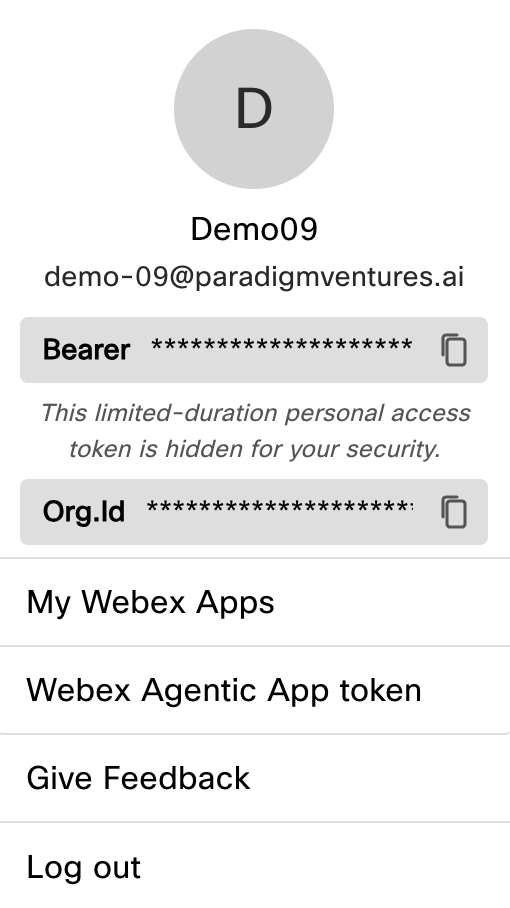
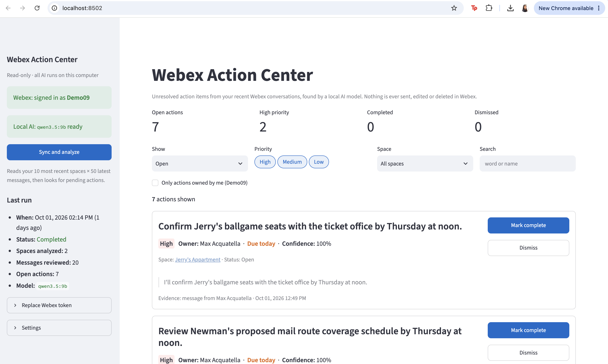

<!--
STYLE GUIDE FOR THE LAB GUIDES (this comment doesn't appear in the preview)
- Headings: one # title per document; ## for main sections; ### for sub-steps.
- Bullets: * for top-level bullets, - for sub-bullets.
- Label bullets: start with a bold label and a colon, e.g. **Ollama:** a free tool...
- Things to click or press: bold, with the exact wording on screen, e.g. click **+ New**, press **Return**.
- Commands: in a code block on their own line, never bold.
- Files, folders and email addresses: `code` style.
- Links: clickable with readable text, e.g. [ollama.com/download](https://ollama.com/download).
- Names: Webex (not WebEx), Claude desktop app, Ollama, uv, Lab 00 / Lab 01 / Lab 02 / Lab 03.
- Images: centered <p align="center"> block with a width, one <br> before and after.
- Placeholders: [PLACEHOLDER - description] on its own line, with an empty line before and after.
- Punctuation: full sentences end with a period; no double spaces; use an em dash (—), not --.
- Spacing: one <br> (with empty lines around it) before each section heading, except the first.
-->


# Lab 02 — Build a Webex Action Center

*Find the open asks and commitments buried in your Webex spaces, using an AI model that runs privately on your laptop*.

## Introduction

Messaging has become one of our main ways of communicating at work, and action items easily get buried there. Someone writes "I'll get back to you with some dates"... and then 100 other messages arrive in other spaces, and it's forgotten. In this lab, you'll build an app that "mines" your recent Webex spaces for those open asks and commitments, using an AI model that runs on your laptop.

The goal is to build a minimum viable product (MVP): a simple, working version that does the main job. Focus on trying ideas, checking that the app works, and using follow-up prompts to improve it. You don't need a polished product by the end—this lab is about practicing how to turn an idea into something useful with AI.

<br>

## Before You Start

Your app may look and work a little differently from the examples—or from the apps built by others in the lab. That's expected! AI coding tools can suggest different approaches, and there are many ways to solve the same problem.

<br>

## What You'll Build

* In this lab, you'll use an AI coding tool (Claude Cowork) to build a local, read-only dashboard that looks at your most recently active Webex spaces, reviews the recent messages in them, and surfaces the unresolved commitments and asks buried in those conversations—so you don't have to scroll back through every space yourself.
* You'll guide the coding tool through prompts, or instructions describing what you want the app to do.
* Start with a basic idea, try what it builds, and use follow-up prompts to fix issues or add improvements.

<br>

## Behind the Scenes (Optional Reading)

Behind the scenes, the app syncs a configurable number of your most recently active spaces and their latest messages into a local SQLite database. It then sends that conversation text to a local Ollama model and uses schema-enforced structured output so the model reliably returns a list of pending tasks—each with a short description, an owner, a priority, a due date when one was mentioned, and a confidence score. The model is instructed to ignore greetings, general discussion, and anything already resolved, and to surface only genuine unresolved commitments or asks. This doesn't train the model on your messages; it just reads them and reports back structured results.

Each extracted task is shown alongside the exact message it came from, so you can check the AI's read of the conversation yourself. You can mark a task complete or dismiss it if the AI got it wrong, and that decision is remembered the next time you open the app. The app is strictly read-only toward Webex: it never sends, edits, or deletes anything in your spaces.

And you can take the code home and keep using it! Once you've set up the required tools on your own computer, you can point it at your own Webex spaces, customize the dashboard, and keep adding features with help from AI.

<br>

## What You'll Need

* **Setup from Lab 00:** the Claude desktop app with a Cowork session connected to your lab folder, and Ollama installed and running. If you haven't done these yet, start with the [Lab 00 Setup guide](Lab_00_Guide_Setup.html).

* **Webex demo account:** the organization account you signed in with in Lab 00. Its spaces already have conversations for the app to analyze.

* **Webex access token:** a personal access token that lets your app read your spaces and messages. You'll get one while Claude builds your app. Don't use a bot token—a bot can't read a user's full conversation history.

* **AI model:** this lab uses `qwen3.5:9b`, a download of several GB. You'll download it while Claude builds your app. If your laptop has only 8 GB of memory, use the smaller `qwen3.5:4b` instead.

* **Internet access:** needed to work with Claude, to download the model, and, unlike Lab 01, while the app runs, because it reads your messages from Webex.

* **Note:** the AI analysis still runs on your laptop. Your messages are read from Webex, but never sent to a cloud AI model.

<br>

## Let's Start Building!

* **Note:** This is a suggested starting prompt. You are welcome to experiment! We strongly recommend, especially if this is early in your AI vibe-coding / building journey, that you start with this prompt and then make whatever changes you'd like later. Don't worry if you don't understand every term in the prompt: you'll learn as you build.

* **Before you send it:** check that your lab folder is connected to this Cowork session (you picked it in Lab 00). If it isn't, add it again.

* **Heads-up:** Claude takes about 10–15 minutes to build the app. See "While You Wait" below for what to do in the meantime.

### Starting Prompt

> Build me a local, read-only dashboard called "Webex Action Center" that connects to my Webex account, reviews my recent conversations, and surfaces unresolved action items using a local AI model. No cloud AI services or external AI API calls—everything should run on my machine.
>
> Use Python 3.12+, uv for dependencies, Streamlit for the interface, and SQLite for local storage.
>
> Here's how it should work:
>
> - Use the Webex REST API with a user access token (not a bot token, since a bot can't read a user's full conversation history) to fetch the most recently active spaces—default to the 10 most recent, but make it configurable.
> - For each space, fetch the latest messages—default to 50 per space, configurable—and store synchronized spaces, messages, and extracted tasks in SQLite.
> - Send the message content to a local Ollama model and use schema-enforced structured outputs so the model reliably returns a list of pending tasks, each with a description, owner, priority, due date, confidence score, and the source message as evidence.
> - Instruct the model to exclude greetings, general discussion, and anything already resolved or completed—only surface genuinely unresolved commitments or asks.
> - Default to the qwen3.5:9b model as the balance of quality and speed for this kind of conversation analysis; support swapping in qwen3.5:4b on lower-memory machines, qwen3.5:27b for higher quality, or gemma3:12b as a conservative alternative.
> - Show a "Sync and analyze" control in the sidebar with a summary of the last run: when it ran, how many spaces were analyzed, and how many messages were reviewed.
> - List the extracted tasks as cards showing description, owner, priority, due date, confidence, and the evidence message, and let me mark each one complete or dismissed—store that decision locally so it persists across restarts.
> - Never send, edit, or delete anything in Webex—this is strictly read-only against the Webex API.
> - Create the project in a subfolder named `lab-02-action-center` inside my connected folder. Configure Streamlit to always run on port 8502 (in `.streamlit/config.toml`), so it won't conflict with my other lab apps and they can all run at the same time. Show the address http://localhost:8502 in both guides described below.
>
> Build the complete working project with clearly organized code and tests for the task-extraction logic (mocked Ollama responses are fine—tests shouldn't require a running Ollama instance).
>
> Make the app easy to start. Create a start file I can double-click: `Start Action Center.command` for macOS (make it executable) and `Start Action Center.bat` for Windows. Each should install uv if it's missing (using uv's official standalone installer, not Homebrew) and call it by its full path, so I don't need to restart Terminal; install the dependencies; and check that Ollama is running and download the model if it's missing. Then it should ask for my Webex access token ("Paste a new Webex token, or press Return to keep the saved one"), without showing the token on screen, and save it in `.env`, so I never have to edit that file by hand. Finally, start the app and open http://localhost:8502 in my browser. Show clear progress messages, and explain how to stop the app.
>
> Write two guides for a beginner, and keep both updated as the code changes. Save each one in the project folder as Markdown, HTML, and PDF (`Quickstart.md`, `Quickstart.html`, `Quickstart.pdf`, and `Application Guide.md`, `Application Guide.html`, `Application Guide.pdf`). In both, include instructions for both macOS (Terminal) and Windows (PowerShell), clearly labeled, wherever the steps or commands differ.
>
> - **Quickstart:** title it "Webex Action Center — Lab 02 Quickstart". Keep it to one page: a one-line summary, the app's folder and address (http://localhost:8502), how to start the app with the start file (including pasting a fresh token when the old one expires after 12 hours), how to stop and restart it, and the manual commands to use if the start file doesn't work.
> - **Application Guide:** title it "Webex Action Center — Lab 02 Application Guide", and make it as descriptive as possible.
>
> The Application Guide should explain:
>
> - What the app does, its main features, and its current limitations.
> - How syncing, task extraction, and the local-only AI pipeline work in plain language.
> - What software and models I need, what the start file installs, and how to create a Webex personal access token.
> - How to run "Sync and analyze," read the task cards, and mark tasks complete or dismissed.
> - What the main files and folders do, and which settings in .env I can change.
> - How to run tests and troubleshoot common problems, including what it means if no pending actions show up.
>
> When you're done, keep your final message to me short: tell me to open `Quickstart.html` and double-click the start file. Help me get a basic working version running first, and we can improve it as we go.

<br>

## While You Wait

Claude is now building your app. This takes about 10–15 minutes, and Claude shows its progress as it works.

* **Take a break:** grab a coffee or stretch your legs!
* **Download the AI model:** open a terminal window (**Terminal** on a Mac, **PowerShell** on Windows) and run this command. It's the biggest download of the day (several GB), so start it now. If your laptop has only 8 GB of memory, download `qwen3.5:4b` instead.

```sh
ollama pull qwen3.5:9b
```

* **Check back every few minutes:** Claude may ask you a question or ask you to approve a step, and it waits until you answer.

### Get Your Webex Access Token

* Go to [developer.webex.com](https://developer.webex.com) and click **Log in**. Use your organization account, `demo-xy@paradigmventures.ai`.
* Click your profile picture (the circle with your initial) at the top right. Next to **Bearer**, click the **copy** icon. The token shows as stars, but it's copied. You'll paste it when you start the app.

<br>
<p align="center">
  
</p>
<br>

* **Note:** the token is valid for **12 hours**. Keep it private: anyone with it can act as you in Webex. Your app only uses it to read.

### Send Your Neighbor a Message

* In Webex, send your neighbor (or a friend in the lab) a message with a clear ask, for example: "Could you send me your notes from today's session by Friday?"
* You'll check whether your app finds this ask in "Try It with a Neighbor" below.

<br>

## Run Your App

When Claude has finished, your project folder, `lab-02-action-center`, contains your app, a start file, and two guides: a **Quickstart** (how to start and stop the app) and an **Application Guide** (how the app works).

* **Open the Quickstart:** in the `lab-02-action-center` folder, double-click `Quickstart.html`. It opens in your browser.
* **Start the app:** double-click `Start Action Center.command` (Mac) or `Start Action Center.bat` (Windows). When it asks, paste your Webex access token and press **Return**. Your Lab 01 app can keep running.
* **Open the app:** your browser opens http://localhost:8502. If it doesn't, type that address into your browser.
* **Keep the terminal window open:** the app runs as long as that window is open. To stop it, click the window and press **Control + C**.

Here is what an initial result could look like:

<br>
<p align="center">
  
</p>
<br>

## Try It

Start by clicking **Sync and analyze** and picking a space where you know there's an open ask or commitment. Check that the extracted task matches what was actually said, and that the evidence quote is the right message. Evidence helps you verify a task, but it doesn't automatically make it correct.

Use these checks to see whether your MVP is working:

* Run **Sync and analyze** and confirm the sidebar shows a recent sync summary with spaces and messages counts.
* Find a task the app extracted and check that its owner, priority, and evidence line up with the real conversation.
* Mark a task complete or dismissed, then refresh the page and confirm the decision stuck.
* Check a space that only has greetings or resolved chatter and confirm the app doesn't invent a task for it.
* Restart the app and confirm your synced spaces, messages, and task decisions are still there.

### Try It with a Neighbor

* You sent your neighbor a message with a clear ask while Claude was building. (If you skipped that step, send one now.)
* Both of you click **Sync and analyze**. Does the app find the task? Who does it say owns it: you, or your neighbor?
* Then reply "Done, sent them!" and sync again. Does the task disappear?

<br>

## Understand What You Built

Your app just did something new: it called a real service's API (Webex) with your own access token, then had a private AI model on your laptop read the results. To see how the pieces fit together, ask Claude (in your Cowork session, not in the app):

> Explain in plain English what I just built and how the pieces fit together. Keep it short, and assume I'm new to this.

For more detail, read "Behind the Scenes" above, or open `Application Guide.html` in your project folder.

<br>

## Save What You Learned as a Skill

Add what you learned in this lab to the skill file you started in Lab 01, `My Building Skill.md`. Send this prompt:

> Update `My Building Skill.md` in my lab folder with what we learned in Lab 02, such as working with an outside service's API, keeping my access token private, and checking the AI's results against the evidence. Keep everything that's already in the file. If the file doesn't exist yet, create it.

In a later session, ask Claude to read `My Building Skill.md` first, and it will build the way you like from the start.

<br>

## If You Get Stuck

If something fails, describe to Claude what you did, what you expected, and what happened. Include the error message when there is one. For example:

> I ran Sync and analyze, but I got this error: [paste error]. Please help me fix it and update the Quickstart and Application Guide if any setup steps are missing.

Common problems:

* **Claude says it can't find your folder:** add your lab folder to the session again, then tell Claude: "I've attached the folder now. Please put the project there."
* **Strange file errors, or the build keeps failing:** check where your lab folder is. If it's inside OneDrive, Dropbox, Box, Google Drive or iCloud (including a synced Desktop or Documents folder), the sync app can lock files while Claude writes them. Create a new folder in your home folder (see Lab 00), add it to the session, and ask Claude to build the project there.
* **The Mac won't open the start file:** right-click `Start Action Center.command`, choose **Open**, then click **Open** again. If it still won't run, ask Claude to make the start file executable.
* **"Webex rejected your access token (401)":** your token has expired (they last 12 hours) or was pasted incorrectly. Stop the app, copy a fresh token from developer.webex.com, double-click the start file again, and paste the new token when it asks.
* **"Can't reach Ollama":** open the Ollama app and check for the llama icon in the menu bar, then try again.
* **"Model isn't downloaded":** run the `ollama pull …` command shown in the message, then try again.
* **"No pending actions found":** the run worked, but no open tasks were found. Check the sidebar's **Last run** summary for problems, or try the neighbor exercise above.
* **The first sync is slow:** the model takes a moment to load, and every space is analyzed for the first time. Later syncs skip spaces that haven't changed.
* **Your laptop slows to a crawl or freezes:** AI models running on your laptop need a lot of memory, and older laptops can struggle. Close other apps first. If that doesn't help, ask Claude: "My laptop is struggling. Please switch the app to the smaller qwen3.5:4b model and update the guides." Or ask a lab proctor for a lab PC.
* **"Port 8502 is already in use":** the app is probably already running in another terminal window. Stop that one with **Control + C**, or use the one that's running.
* **Anything else:** copy the error message into Claude and ask for help, as in the example above.

<br>

## Key Takeaways

In this lab, you practiced turning an idea into a working Python app with help from AI. You described what you wanted, tested the results, and used follow-up prompts to make improvements. You also explored how a local AI model can read real conversations and turn them into structured, checkable information instead of a wall of chat history.

You also took a step beyond a self-contained tool: this app talks to a live external service. By calling the Webex REST API with your own access token, you pulled your real spaces and messages into a project you built yourself, rather than working against sample or synthetic data. That's the same integration pattern behind most real-world productivity tools—authenticate, call an API, work with the data it returns—and you now have hands-on experience with it, including the read-only precautions (like avoiding a bot token, and never sending, editing, or deleting anything) that responsible use of a platform API requires.

Building with AI is an iterative process. Clear prompts, checking the results against the actual evidence, and keeping useful guides all help you create an MVP you can understand, run, and improve. Take what you've built, point it at your own Webex spaces, and keep experimenting!

* **Next:** leave this app running (keep its terminal window open) and move on to [Lab 03 — Build an Image-to-Calendar Assistant](Lab_03_Guide_Image_to_Calendar.html), or try the optional improvements below first.

<br>

## Optional: Improve It

If you have time, try improving your Action Center. Make one change at a time and try the app again, so you can see whether the change helped. Here are two improvements we found while testing this lab. Try them if you see the same thing:

> Every task shows 100% confidence, so the score doesn't help me. Please make the confidence scores more realistic, so clear asks score high and vague ones score lower.

> Tasks that belong to me show my full name as the owner. Please show "You" as the owner for my own tasks, and add a filter to show only my tasks.

Or, if the app picks up something that isn't a real task:

> The app found a task in a space that was really just a joke, not a real commitment. Help me tighten the extraction logic or the prompt so it's more conservative.

<br>

## What's Next

* **Next:** you've built your Webex Action Center! Continue to [Lab 03 — Build an Image-to-Calendar Assistant](Lab_03_Guide_Image_to_Calendar.html).
* **Before you leave:** see [How to Save Your Work for Later](Lab_Save_Your_Work.html), so you can pick up where you left off.
